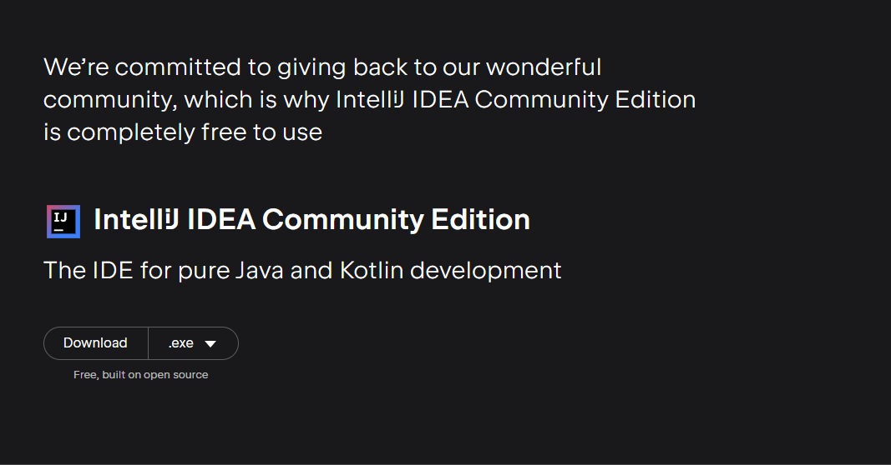
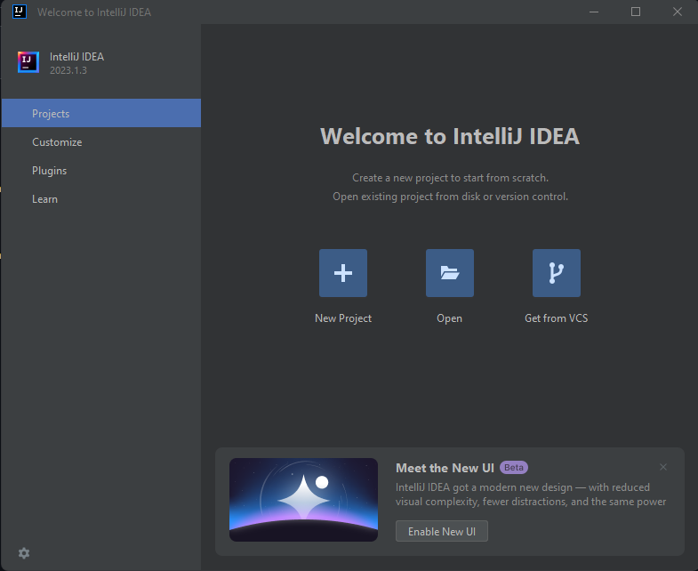
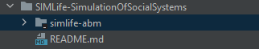
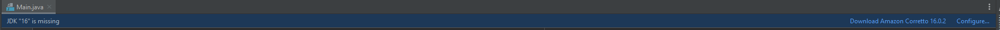

# SocialInsight

## Getting Started

*The following steps assume you know how to clone a repository from Github, and that you have already cloned this repository into your local system.*

To get started you will need JDK, to download it go [here](https://www.oracle.com/java/technologies/downloads/#jdk20-windows), and the preferred IDE for this project is Intellij, more specifically the Community Edition as seen in Figure 1, which can be found [here](https://www.jetbrains.com/idea/download/?section=windows).

<em>Figure 1: Downloading Intellij Community Edition</em>

Once you have installed both JDK and Intellij Community Edition, open Intellij, you should see the following:

<em>Figure 2: Opening Intellij Community Edition</em>

You will want to create the Open button, and select the folder in which this repository is in, AND you will want to select the simlife-abm folder, to ensure a smooth project run. 
:exclamation:**IMPORTANT**:exclamation: make sure you are opening the simlife-abm folder.

<em>Figure 3: Selecting simlife-abm folder after clicking Open in Intellij</em>

The project should open after you have selected the folder and pressed open.
Should the following (Figure 4) pop up on the top of the IDE, you may need to either download the version of JDK that you are missing (the one that says in the warning), OR if you want to update the project to be of the version of JDK you currently have, you may choose to press *Configure* and select your own version - should only be done if you are updating the project or will not be contributing to it.

<em>Figure 4: JDK version warning</em>

Once there is no warning, you may press the green play button to run the program, which will start by running Main.java.
