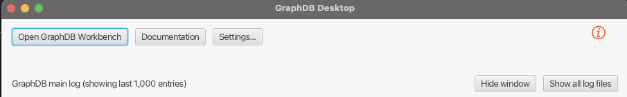
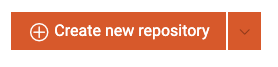
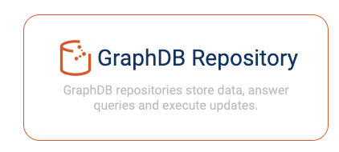
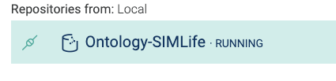
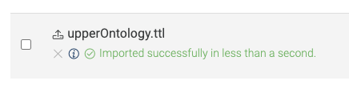
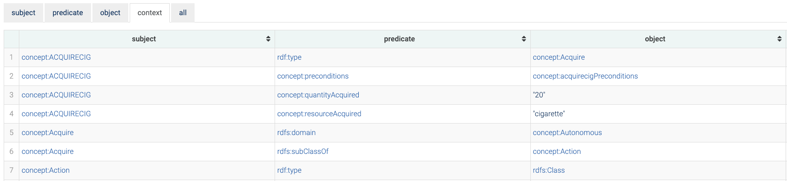
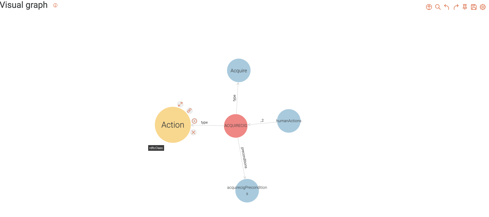

# Using GraphDB to visualize the ontology

GraphDB is a very good tool to not only visualize the ontology but also test out Spark queries. 
SparkQL is the query language used in both GraphDB and Apache Jena to retrieve information from the ontology.

## Set up GraphDB

### Step 1, downloading GraphDB

Go to https://graphdb.ontotext.com/ and download GraphDB.

### Step 2, opening GraphDB

Open GraphDB, it will open up a command window and it will open the DB on the browser. 
If the browser doesn't open, you may open the GraphDB Desktop window and press "Open GraphDB Workbench"
as seen in the following figure:

### Step 3, creating and connecting a repository

Once the browser window for GraphDB is open you may go to Setup, and then click repositories. 
From then on you should see a button to create Create New Repository as follows:

After pressing it you should select the following option:

Where you will have to fill the name of the repository, and the options may be left as default. Once your repository has been created, make sure it is running, the icon on the left of the repository name should look green as the following:

If it doesn't then press the icon that should be green and GraphDB will turn on the repository.

### Step 4, importing ontologies

Once the repository is up and running, to import your ontologies or the ontologies in this repository, you can go to **Import** on the left-hand side of the GraphDB window.
In the Import window, you have three different options for importing ontologies, the one we will be covering in this step is option 1: Upload RDF files.
Within this repository and the simlife-abm folder, you have ontology files ending with .ttl. 
*  The file used within the simulation is currently *substance-use.ttl*, which should contain everything in the upper-ontology and the domain-specific ontology.
*  The upperOntology.ttl file contains the definition of ontological terms used in the domain-specific ontology (domainSpecificOntology.ttl) and is therefore needed for properly viewing and querying the domain-specific ontology.
*  The domainSpecificOntology.ttl contains the definition of a social domain to be used in the simulation, therefore which agents, what kind of parameters, actions, perceptions and causal relationships.

When you press **Upload RDF files** you will be prompted to select a file, you may select one or more of the above, but for a complete view of the current state of the ontologies, you may first select the upper-ontology and later do the same for the domain-specific, or select the substance-use.ttl which contains both the upper-ontology terms, and the domain-specific terms for the use case of substance use in youth.

Once you have selected the ontology file, the file will be added to the list of imports. You may then proceed to press the import button on the right-hand side of that item in the list, and you will be prompted with the following window:

In the **Base IRI** field you should put in the basic iri that defines new concepts that do not belong to RDF or any other imports within the ontology. In all of the ontologies mentioned above, this IRI is: https://www.dictionary.com/browse/
Once you have entered the Base IRI, press Import and the ontology should be imported successfully as the image follows:

As previously mentioned, if you are importing the upperOntology.ttl file, and want to preview the domain-specific content, you will need to repeat this step and select the domainSpecificOntology.ttl file, and using the same IRI.

### Step 5, visualizing ontological content

To preview the existing content of the loaded ontologies, go to the **Explore** tab on the left-hand side > Graphs Overview > default graph.
Within the default graph you should see a table with all of the triples (subject-predicate-object) within the ontology, as follows: 

To preview connections you can press any of the subjects in the subject column, and then press **Visual Graph** on the top right.
The display you will see should be akin to the following image:

Every node (or bubble) within that graph has 4 options when hovered on:
* Expand: expands the node to show the next (1-depth) connections.
* Copy to clipboard: shows the full link of the node.
* Focus: shows the immediate connections to that node.
* Remove: removes the node and its exclusive connections from the visualization, these connections are not removed in the actual data and may be opened again in the graph by expanding nodes.

Furthermore, some nodes may contain information that is not displayed in the graph itself, such as values and indexed content. To preview these values you may left click the node, from which a window will pop up on the right side of the graph.

