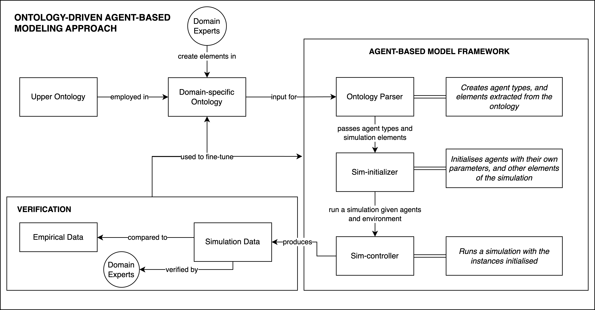

# Introduction

The following file contains documentation for the classes and functions existing in this project.

The SIMLife approach is made up of three main interconnected components: an upper-ontology, a domain-specific ontology, and an agent-based model (ABM) 
framework. The upper-ontology describes terms encapsulating the components of an ABM, such as agents, parameters, actions, and perceptions. 
The domain-specific ontology describes a target social phenomenon to simulate using the general-terms from the upper-ontology, and therefore in the 
context of ABMs. Lastly, the ABM framework utilises the domain information provided - by means of a file with the combination of the ontologies 
aforementioned - to execute a simulation given pre-defined settings. 

<p></p>
<p><em>Figure 1: Illustration of the iterative process involved in the ontology-driven agent-based modeling approach (SIMLife) </em></p>

Illustrated in Figure 1 is the complete flow of the iterative process in SIMLife, as previously mentioned the ontologies are used as input 
for the ABM framework made up of three distinct components and steps to running a complete simulation: Ontology Parser, Sim-Initializer, 
and Sim-Controller. As the name entails, the ontology parser is a class that parses the information from the ontologies, it is the first 
component in the framework, and it contains the necessary functions to retrieve the correct information that will later be used by the 
Sim-Initializer to instanciate the agent. The Sim-Initializer takes the parsed information from the Ontology Parser and initializes the 
agents according to pre-defined settings provided as input. Finally, the Sim-Controller takes the agent instances as input and settings 
on the number of iterations, and runs a simulation.

The following sections cover the specific functionality of each component, input, attributes, and methods.

# Ontology-Parser 

## Input & Initialization

The Ontology Parser takes in a single input as a String: the filename of the file containing both the upper-ontology and domain-specific ontology to 
be used in the simulation. This file should be a .ttl (Turtle Syntax file), more information [here](https://www.w3.org/2007/02/turtle/primer/) on 
how to write Turtle syntax.

The constructor begins by first creating a RDF Model (ApacheJena) and reading the complete ontology (upper + domain-specific) in the file provided 
into the model. 
```
this.model = ModelFactory.createDefaultModel();
model.read("./substance-use.ttl");
```
Following this, an inference model is created from the previous model. This is an important step as it allows us to infer certain information such as 
inheritance.
```
this.imodel = ModelFactory.createRDFSModel(model);
```
The last step in the constructor is to create empty array lists for parameters, perceptions, and perception relationships, and to call the main 
function **parse_data()**.

## Attributes
There are a total of 14 attributes within this class:
* *base_prefix*, *base_uri*, *rdf_uri*, *rdfs_uri*, and *base_query_header* are all attributes required for querying with SPARQL and
retrieving the information in the ontologies. 
  * *base_prefix* is the prefix term used in the denomination of our terms, created specifically for SIMLife.
  * *base_uri* is the website link containing descriptions and pages for the terms.
  * *rdf_uri* is the link to version of RDF used in the ontologies.
  * *rdfs_uri* is the link to version of RDFS used in the ontologies.
  * *base_query_header* is the header required to run the queries on the model, composed of the variables mentioned in this sub-list.
* *model*, *imodel* and *filename* as aforementioned are the initalized ApacheJena models.
  * *model* is a base RDF model from ApacheJena.
  * *imodel* is a RDF inference model from ApacheJena.
  * *filename* is the name of the file containing both the upper and domain-specific ontology.
* *parameters*, *perceptions*, *perceptionRelationships*, *movementActions*, *acquireActions*, *consumeActions* are lists of important agent attributes
described in the upper-ontology and utilised to create unique agent types within the domain-specific ontology.
  * *parameters* are of type Parameter, they describe the characteristics of agents.
  * *perceptions* are of type Perception and contain a list of perceptions available to the agents.
  * *perceptionRelationships* are of type PerceptionRelationship and contain a list of relationships between Perception and one or more Parameter. 
  * *movementActions*, *acquireActions*, *consumeActions* are lists of actions of types MoveTo, Acquire, and Consume available to the agents.

## Methods

There are a total of 30 methods within this class:
* *parse_data()* : 
  * input: none
  * output: none
  * functionality: step by step calls the methods responsible for retrieving parameter, perception, and action types for the agents.
* *inferredInheritanceCheck()* :
    * input: ```String```
    * output: ```List<String>```
    * functionality: For the input agent name, this function retrieves all the other agent types it inherits from (E.g. Child inherits from Human, and Human inherits from Autonomous, ...)
* *retrieveParameters()* :
    * input: ```List<String>```
    * output: none
    * functionality: Adds to the *parameters* variable all of the parameters of the target class and inherited ones.


# Sim-Initializer

## Input & Initialization

## Attributes

## Methods

# Sim-Controller

## Input & Initialization

## Attributes

## Methods